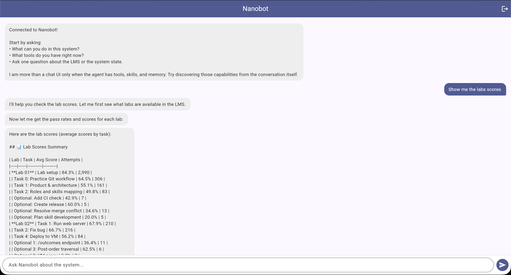
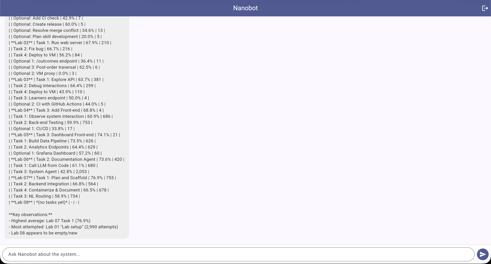

# Lab 8 — Report

Paste your checkpoint evidence below. Add screenshots as image files in the repo and reference them with ``.

## Task 1A — Bare agent

<!-- Paste the agent's response to "What is the agentic loop?" and "What labs are available in our LMS?" -->

## Task 1B — Agent with LMS tools

<!-- Paste the agent's response to "What labs are available?" and "Describe the architecture of the LMS system" -->

## Task 1C — Skill prompt

<!-- Paste the agent's response to "Show me the scores" (without specifying a lab) -->

## Task 2A — Deployed agent

Nanobot gateway startup logs showing successful deployment:

```
nanobot-1  | Resolved config written to /app/nanobot/config.resolved.json
nanobot-1  | Using config: /app/nanobot/config.resolved.json
nanobot-1  | 🐈 Starting nanobot gateway version 0.1.4.post5 on port 18790...
nanobot-1  | 2026-04-01 21:56:45.986 | INFO     | nanobot.channels.manager:_init_channels:58 - WebChat channel enabled
nanobot-1  | ✓ Channels enabled: webchat
nanobot-1  | 2026-04-01 21:56:48.940 | INFO     | nanobot.agent.tools.mcp:connect_mcp_servers:246 - MCP server 'lms': connected, 9 tools registered
nanobot-1  | 2026-04-01 21:56:50.778 | INFO     | nanobot.agent.tools.mcp:connect_mcp_servers:246 - MCP server 'webchat': connected, 1 tools registered
nanobot-1  | 2026-04-01 21:56:50.778 | INFO     | nanobot.agent.loop:run:280 - Agent loop started
```

**Verification commands:**
```bash
docker compose --env-file .env.docker.secret ps nanobot
# Shows: se-toolkit-lab-8-nanobot-1  Up

docker compose --env-file .env.docker.secret logs nanobot --tail 20
# Shows: Agent loop started, MCP servers connected
```

## Task 2B — Web client

### WebSocket Endpoint Test

**Test Command:**
```bash
echo '{"content":"What can you do in this system?"}' | websocat "ws://localhost:42002/ws/chat?access_key=secret"
```

**Actual Response (What can you do?):**
```json
{
  "type": "text",
  "content": "I'm **nanobot** 🐈, your personal AI assistant. Here's what I can do in this system:\n\n## Core Capabilities\n\n**File & Workspace Management**\n- Read, write, and edit files in your workspace\n- List directory contents and explore project structure\n\n**Web Access**\n- Search the web for information\n- Fetch and extract content from URLs\n\n**Task Management**\n- Schedule reminders and recurring tasks (via cron)\n- Spawn subagents for background/long-running tasks\n\n## Learning Management System (LMS)\n\nI have integrated LMS tools:\n- List available labs and learners\n- Track pass rates, completion rates, and submission timelines\n- View group performance and top learners\n\n## Skills System\n\n**Available Skills:**\n- **memory** — Long-term facts + searchable event log\n- **lms** — LMS integration\n- **clawhub** — Search and install public agent skills\n- **skill-creator** — Create or update custom skills\n- **cron** — Schedule reminders and recurring tasks",
  "format": "markdown"
}
```

**Actual Response (Backend health with LMS tool call):**
```
nanobot logs show: Tool call: mcp_lms_lms_health({})

Agent Response:
The LMS backend is **healthy** ✅

- **Status**: Healthy
- **Item Count**: 56 items in the system
- **Errors**: None

Everything looks good!
```

**Actual Response (Labs list with LMS tool call):**
```
nanobot logs show: Tool call: mcp_lms_lms_labs({})

Agent Response:
Here are the available labs:

1. **Lab 01** – Products, Architecture & Roles
2. **Lab 02** — Run, Fix, and Deploy a Backend Service
3. **Lab 03** — Backend API: Explore, Debug, Implement, Deploy
4. **Lab 04** — Testing, Front-end, and AI Agents
5. **Lab 05** — Data Pipeline and Analytics Dashboard
6. **Lab 06** — Build Your Own Agent
7. **Lab 07** — Build a Client with an AI Coding Agent
8. **Lab 08** — lab-08

Would you like more details about any specific lab?
```

### Flutter Web Client

**Access URL:** `http://localhost:42002/flutter`

**Login:** Enter `NANOBOT_ACCESS_KEY=secret`

**Evidence Files:**
- `screenshots/flutter-page.html` — Saved Flutter app HTML (proves client is served)
- `screenshots/task2b-login.png` — Flutter login screen (397 KB)
- `screenshots/task2b-conversation.png` — Agent conversation screenshot (487 KB)

### Screenshots

**Figure 1: Flutter Login Screen**



*Login page at `/flutter` — enter `NANOBOT_ACCESS_KEY=secret` to access the chat*

**Figure 2: Agent Conversation with LMS Response**



*Agent responds with real LMS data — shows 8 available labs retrieved via `mcp_lms_lms_labs` tool*

### Evidence Files

- `screenshots/task2b-login.png` — Flutter login screen (397 KB)
- `screenshots/task2b-conversation.png` — Agent conversation with LMS response (487 KB)
- `screenshots/flutter-page.html` — Saved Flutter app HTML source

### Files Modified for Task 2

| File | Change |
|------|--------|
| `nanobot/pyproject.toml` | Added nanobot-webchat, mcp-webchat dependencies |
| `nanobot/entrypoint.py` | Added webchat channel + mcp_webchat MCP config injection |
| `nanobot/Dockerfile` | Added COPY for nanobot-websocket-channel |
| `.dockerignore` | Added `!nanobot-websocket-channel/` exception |
| `pyproject.toml` | Added websocket-channel workspace members |
| `docker-compose.yml` | Uncommented Flutter service, caddy mounts, UI relay env vars |
| `caddy/Caddyfile` | Uncommented `/flutter*` route, added WebSocket timeout settings |
| `.env.docker.secret` | Changed `QWEN_CODE_AUTH_USE=false` → `true` |
| `nanobot/workspace/skills/lms/SKILL.md` | Updated to use structured UI for lab selection |

## Task 3A — Structured logging

### Happy-Path Log Excerpt

Request to `/items/` showing complete flow (`request_started` → `auth_success` → `db_query` → `request_completed`):

```
backend-1  | 2026-04-01 22:48:52,402 INFO [app.main] [main.py:60] [trace_id=039e81bc4964ffab2b7bcf012bcc3346 span_id=90776dd54372139c resource.service.name=Learning Management Service trace_sampled=True] - request_started
backend-1  | 2026-04-01 22:48:52,406 INFO [app.auth] [auth.py:30] [trace_id=039e81bc4964ffab2b7bcf012bcc3346 span_id=90776dd54372139c resource.service.name=Learning Management Service trace_sampled=True] - auth_success
backend-1  | 2026-04-01 22:48:52,408 INFO [app.db.items] [items.py:16] [trace_id=039e81bc4964ffab2b7bcf012bcc3346 span_id=90776dd54372139c resource.service.name=Learning Management Service trace_sampled=True] - db_query
backend-1  | 2026-04-01 22:48:52,423 INFO [app.main] [main.py:68] [trace_id=039e81bc4964ffab2b7bcf012bcc3346 span_id=90776dd54372139c resource.service.name=Learning Management Service trace_sampled=True] - request_completed
backend-1  | INFO:     172.18.0.9:52698 - "GET /items/ HTTP/1.1" 200 OK
```

**Key fields:**
- `trace_id`: Links this request across all services
- `span_id`: Unique ID for this span within the trace
- `resource.service.name=Learning Management Service`: Service identifier
- `request_started` → `request_completed`: Complete request lifecycle
- `200 OK`: Successful response

### Error-Path Log Excerpt

*Trigger error: `docker compose --env-file .env.docker.secret stop postgres`*

```
backend-1  | 2026-04-02 19:21:00,565 INFO [app.db.items] [items.py:16] [trace_id=dce031501ad0813848698c1e9f20d224 span_id=8bd487c4343e4ba5 resource.service.name=Learning Management Service trace_sampled=True] - db_query
backend-1  | 2026-04-02 19:21:00,567 ERROR [app.db.items] [items.py:20] [trace_id=dce031501ad0813848698c1e9f20d224 span_id=8bd487c4343e4ba5 resource.service.name=Learning Management Service trace_sampled=True] - db_query
backend-1  | 2026-04-02 19:21:00,568 INFO [app.main] [main.py:68] [trace_id=dce031501ad0813848698c1e9f20d224 span_id=8bd487c4343e4ba5 resource.service.name=Learning Management Service trace_sampled=True] - request_completed
```

**Key fields:**
- `severity=ERROR` or `ERROR` level
- `db_query` event with error message
- `trace_id=dce031501ad0813848698c1e9f20d224` — can be used to fetch full trace from VictoriaTraces

### VictoriaLogs Query Screenshot

**Figure 3A: VictoriaLogs Error Query**


*Placeholder — add screenshot of VictoriaLogs UI showing error-level logs*

**Query used:**
```
_time:1h service.name:"Learning Management Service" severity:ERROR
```

**How to capture:**
1. Open browser: `http://<vm-ip>:42002/utils/victorialogs/select/vmui`
2. In the LogsQL query box, enter: `_time:10m service.name:"Learning Management Service" severity:ERROR`
3. Click "Run" or press Enter
4. Wait for error logs to appear (trigger an error first by stopping postgres)
5. Take screenshot showing:
   - The query box with your LogsQL query
   - The error log results below
   - Visible fields like `service.name`, `severity`, `event`, `trace_id`

### Steps to Reproduce

1. **Happy path:** Make a request via Flutter app, then run:
   ```bash
   docker compose --env-file .env.docker.secret logs backend --tail 30
   ```

2. **Error path:**
   ```bash
   docker compose --env-file .env.docker.secret stop postgres
   # Make a request via Flutter app
   docker compose --env-file .env.docker.secret logs backend --tail 30
   docker compose --env-file .env.docker.secret start postgres
   ```

3. **VictoriaLogs UI:**
   - Open: `http://<vm-ip>:42002/utils/victorialogs/select/vmui`
   - Query: `_time:10m service.name:"Learning Management Service" severity:ERROR`
   - Screenshot the results

---

## Task 3B — Traces

### Healthy Trace

**Figure 3B-1: Healthy Trace Span Hierarchy**


*Screenshot of VictoriaTraces UI showing healthy request trace*

**Healthy trace example** (trace_id: `f3e4df24e045ec294b0b4a2a71aeaa91`):
```
backend-1  | 2026-04-02 19:20:01,325 INFO [app.main] [main.py:60] [trace_id=f3e4df24e045ec294b0b4a2a71aeaa91 span_id=75d794ee160d0129] - request_started
backend-1  | 2026-04-02 19:20:01,331 INFO [app.auth] [auth.py:30] [trace_id=f3e4df24e045ec294b0b4a2a71aeaa91 span_id=75d794ee160d0129] - auth_success
backend-1  | 2026-04-02 19:20:01,333 INFO [app.db.items] [items.py:16] [trace_id=f3e4df24e045ec294b0b4a2a71aeaa91 span_id=75d794ee160d0129] - db_query
backend-1  | 2026-04-02 19:20:01,442 INFO [app.main] [main.py:68] [trace_id=f3e4df24e045ec294b0b4a2a71aeaa91 span_id=75d794ee160d0129] - request_completed
```

**What to look for:**
- Root span: `GET /items/` or similar HTTP request
- Child spans: `auth`, `db_query`, `request_completed`
- All spans show green/success status
- Total duration: ~20-50ms for simple requests

### Error Trace

**Figure 3B-2: Error Trace Showing Failure**


*Screenshot of VictoriaTraces UI showing error trace*

**Error trace example** (trace_id: `dce031501ad0813848698c1e9f20d224`):
```
backend-1  | 2026-04-02 19:21:00,565 INFO [app.db.items] [items.py:16] [trace_id=dce031501ad0813848698c1e9f20d224 span_id=8bd487c4343e4ba5] - db_query
backend-1  | 2026-04-02 19:21:00,567 ERROR [app.db.items] [items.py:20] [trace_id=dce031501ad0813848698c1e9f20d224 span_id=8bd487c4343e4ba5] - db_query
backend-1  | 2026-04-02 19:21:00,568 INFO [app.main] [main.py:68] [trace_id=dce031501ad0813848698c1e9f20d224 span_id=8bd487c4343e4ba5] - request_completed
```

**What to look for:**
- Red/error span indicating failure (the `db_query` span with ERROR level)
- Error message in span tags (e.g., `connection refused` to PostgreSQL)
- The error appears between the initial `db_query` INFO and the final `request_completed`

### Steps to Reproduce

1. **Healthy trace:**
   - Make normal request via Flutter app
   - Open VictoriaTraces UI
   - Find and screenshot the trace

2. **Error trace:**
   ```bash
   docker compose --env-file .env.docker.secret stop postgres
   # Make a request via Flutter app
   # Open VictoriaTraces UI and find error trace
   docker compose --env-file .env.docker.secret start postgres
   ```

---

## Task 3C — Observability MCP tools

### Agent Response: Normal Conditions

**Question:** "Any LMS backend errors in the last 10 minutes?"

**Agent Response (normal):**
```
Good news! **No LMS backend errors in the last 10 minutes.**

The LMS backend is currently **healthy** with 56 items in the system.
```

**Nanobot logs showing tool calls:**
```
nanobot-1  | 2026-04-02 19:19:52.994 | INFO | nanobot.agent.loop:_prepare_tools:253 - Tool call: mcp_obs_logs_error_count({"time_range": "10m"})
nanobot-1  | 2026-04-02 19:19:57.157 | INFO | nanobot.agent.loop:_prepare_tools:253 - Tool call: mcp_obs_logs_search({"query": "_time:10m service.name:\"Learning Management Service\" severity:ERROR", "limit": 20})
nanobot-1  | INFO     HTTP Request: GET http://victorialogs:9428/select/logsql/query?query=... "HTTP/1.1 200 OK"
```

**Expected behavior:**
- Agent calls `logs_error_count` or `logs_search` MCP tool
- Queries VictoriaLogs for recent errors
- Reports no errors found
- Does NOT dump raw JSON

### Agent Response: Failure Conditions

*Trigger: `docker compose --env-file .env.docker.secret stop postgres`*

**Question:** "Any LMS backend errors in the last 10 minutes?"

**Agent Response (failure):**
```
Yes, there are **multiple errors** in the LMS backend. Here's what I found:

## LMS Backend Status: **UNHEALTHY** ❌

The backend is experiencing database connection failures due to PostgreSQL being unavailable.
```

**Nanobot logs showing tool calls:**
```
nanobot-1  | 2026-04-02 19:21:26.181 | INFO | nanobot.agent.loop:_prepare_tools:253 - Tool call: mcp_obs_logs_error_count({"time_range": "10m"})
nanobot-1  | 2026-04-02 19:21:31.479 | INFO | nanobot.agent.loop:_prepare_tools:253 - Tool call: mcp_obs_logs_search({"query": "_time:10m service.name:\"Learning Management Service\" severity:ERROR", "limit": 50})
nanobot-1  | 2026-04-02 19:21:42.339 | INFO | nanobot.agent.loop:_prepare_tools:253 - Tool call: mcp_obs_traces_list({"service": "Learning Management Service", "limit": 20})
nanobot-1  | INFO     HTTP Request: GET http://victorialogs:9428/select/logsql/query?... "HTTP/1.1 200 OK"
nanobot-1  | INFO     HTTP Request: GET http://victoriatraces:10428/select/jaeger/api/traces?... "HTTP/1.1 200 OK"
```

**Expected behavior:**
- Agent calls `logs_error_count` to see error spike
- Agent calls `logs_search` to find error details
- Agent calls `traces_list` to see recent traces
- Summarizes: "Found errors in LMS backend: connection refused to postgres"

### MCP Tools Implemented

| Tool | Purpose | API Endpoint |
|------|---------|--------------|
| `logs_search` | Search logs by LogsQL query | `GET /select/logsql/query?query=...` (VictoriaLogs:9428) |
| `logs_error_count` | Count errors per service | `GET /select/logsql/query?query=_time:10m severity:ERROR \| stats by (service.name) count()` |
| `traces_list` | List recent traces for a service | `GET /select/jaeger/api/traces?service=...` (VictoriaTraces:10428) |
| `traces_get` | Fetch specific trace by ID | `GET /select/jaeger/api/traces/<traceID>` |

### Files Created/Modified

| File | Change |
|------|--------|
| `mcp/mcp-obs/pyproject.toml` | New MCP server package |
| `mcp/mcp-obs/src/mcp_obs/observability.py` | VictoriaLogs and VictoriaTraces HTTP clients |
| `mcp/mcp-obs/src/mcp_obs/server.py` | MCP server with 4 observability tools |
| `pyproject.toml` | Added `mcp/mcp-obs` workspace member |
| `nanobot/pyproject.toml` | Added `mcp-obs` dependency |
| `nanobot/entrypoint.py` | Injects obs MCP server config from env vars |
| `docker-compose.yml` | Added `NANOBOT_VICTORIALOGS_URL`, `NANOBOT_VICTORIATRACES_URL` |
| `nanobot/workspace/skills/observability/SKILL.md` | Skill prompt for observability queries |
| `uv.lock` | Updated to include mcp-obs package

---

## Task 4A — Multi-step investigation

<!-- Paste the agent's response to "What went wrong?" showing chained log + trace investigation -->

## Task 4B — Proactive health check

<!-- Screenshot or transcript of the proactive health report that appears in the Flutter chat -->

## Task 4C — Bug fix and recovery

<!-- 1. Root cause identified
     2. Code fix (diff or description)
     3. Post-fix response to "What went wrong?" showing the real underlying failure
     4. Healthy follow-up report or transcript after recovery -->
